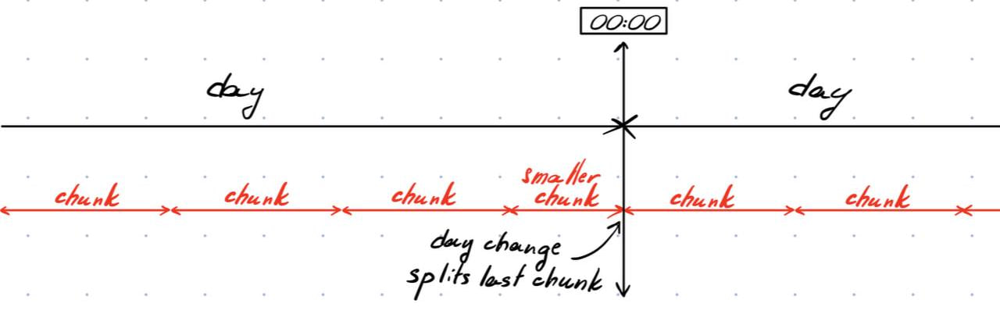

# Packet Concatenation

## Table of Contents

- [Packet Concatenation](#packet-concatenation)
  - [Table of Contents](#table-of-contents)
  - [About ](#about-)
  - [Getting Started ](#getting-started-)
    - [Prerequisites](#prerequisites)
    - [Installing](#installing)
    - [Configuration](#configuration)
      - [Specific configuration](#specific-configuration)
  - [Usage ](#usage-)
    - [Manual use](#manual-use)
      - [Using Python](#using-python)
      - [Using bash](#using-bash)
    - [Scheduling](#scheduling)
      - [Configure systemd service](#configure-systemd-service)
      - [Configure systemd timer](#configure-systemd-timer)
      - [Activating timer](#activating-timer)
  - [Questions ](#questions-)
    - [Splitting](#splitting)


## About <a name = "about"></a>

Packet concatenation combines all packets in the client's output to chunks of the specified length. Script runs once per day at specified time. 

## Getting Started <a name = "getting_started"></a>

To set up packet concatenation, you have to ensure that you have fresh Python installation (>=3.10).

### Prerequisites

This project has scheduling scripts, which could help automate packet concatenation. The scheduling implemented using `bash` and `systemd-timers`, so it is **UNIX-systems with systemd only**.

### Installing

A step by step series of guide that tell you how to get a packet concatenation running.

**Make sure, that you completed all installation steps described in [README](../README.md).**

Create virtual environment for Packet Concatenation:

```
python -m venv .venv_concat
```

Activate virtual environment (bash):
```
source .venv_concat/bin/activate
```

Install required modules
```
pip install -r requirements_concat.txt
```

### Configuration

#### Specific configuration

Specifically for DAS client `config.ini` contains several parameters: `TIME_DIFF_THRESHOLD`, `DATA_LOSE_THRESHOLD`, `CONCAT_TIME`.

`TIME_DIFF_THRESHOLD` used to reduce calculations if packet has redundancy (in seconds). By default 3.01. Calculated as:
```
 TIME_DIFF_THRESHOLD = (packet length without redundancy) + (packet redundancy length / 2) + bias 
```
where `bias` is arbitrary small value, for internal calculations.

`DATA_LOSE_THRESHOLD` is threshold which defines unrecoverable loss of data (in seconds). By default 5. Calculated as:

```
DATA_LOSE_THRESHOLD = (packet length without redundancy) + (packet redundancy length) + (packet length without redundancy / 2)
```

`CONCAT_TIME` length of chunks processed by Packet Concatenation after concatenation (in seconds)

Ensure that you provided properly updated `config.ini` and you ready to go.

## Usage <a name = "usage"></a>

Script will scan `LOCALPATH` directory (provided in `config.ini`) for subdirectories named in `YYYYMMDD`  format. For each subdirectory script will require read and write (600) permissions.

### Manual use

#### Using Python 

If you want to run project once, you can do this using Python directly:

*Ensure you activated virtual environment*

```
source .venv_concat/bin/activate
```
Run Packet Concatenation
```
python src/concat.py
```

#### Using bash 

Project provide `bash` wrapper around Python project, which sets up PATH, virtual environment by itself.  

To use `bash` script, you will have to setup it: 
In the `concat.sh` in root directory of the project change `PROJECT_PATH` to **absolute PATH of root directory of this project**.

> Example:
```
# Changing directory to main project directory
pushd /home/earthquake_lover/Projects/DAS-FEBUS-RECEIVER
```

Change `concat.sh` permissions to include execute permission (700):
```
> chmod 700 concat.sh
``` 

Run the project
```
> bash concat.sh
```

### Scheduling

You can setup scheduling using cron or any other scheduling software. This repository provide plug-and-play `systemd` service and timer.

If you want to use `systemd-timer` Ensure that your system uses systemd:
```
Input:
> systemd --version

Output: 
< systemd 252 (252.17-1~deb12u1)
```

If your system uses you can proceed with scheduling:

**Make sure to complete [Using Bash](#using-bash)**. We will use `concat.sh` in your scheduling script.

In the `systemd` directory you can find every `systemd` service and timer we will use.

#### Configure systemd service

You have to edit `FebusConcatDaily.service` by changing `PROJECT_PATH` to create **absolute PATH to `concat.sh`** (by default it would be the same PATH you provided in `concat.sh`).

> Example:
```
[Service]
ExecStart=/bin/bash /home/earthquake_lover/Projects/DAS-FEBUS-RECEIVER/concat.sh
```

#### Configure systemd timer

By default systemd timer will run Packet Concatenation once per day at 3am local time. If you want to change frequency or starting time, you can change `FebusConcatDaily.timer`

> Example:
> 
```
[Timer]
OnCalendar=*-*-* 3:00:00    # This setup runs concat.sh once per day at 3am.
Persistent=true
```
> Note: By default timer has property `Persistent=true` to enable the timer to start the scheduled concatenation even after complete lost power on the machine during the expected time period

#### Activating timer

Now you can proceed with providing `systemd` with new service and timer:

Copy service and timer to `/etc/systemd/system` directory:
```
sudo cp systemd/FebusConcatDaily.service /etc/systemd/system
sudo cp systemd/FebusConcatDaily.timer /etc/systemd/system
```

Activate timer using `systemctl`:
```
sudo systemctl enable FebusConcatDaily.timer
sudo systemctl daemon-reload
sudo systemctl start FebusConcatDaily.timer
```

Hooray! Timer is set up and will automatically run concatenation once a day. To check that timer was successfully activated we can run: 

```
systemctl list-timers
```

Among listed timers you would be able to see `FebusConcatDaily.timer`, which activates `FebusConcatDaily.service`

## Questions <a name = "wiki"></a>

### Splitting

We choose to prioritize day splitting over chunk splitting to ensure that the beginning of the first chunk of the day coincides with the start of the day (according to UTC).

The priority of splitting goes: 
1. Day 
2. Chunk

As shown on the diagram:


*Scheme of the day-chunk splitting*
